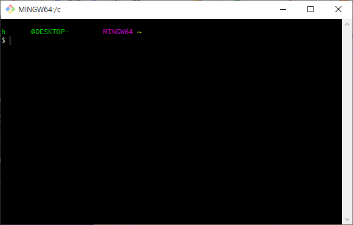

# FINL Virtual Machine

As a core element of FINL, it is used everywhere, including User, Block Explorer, and Block Chain Core.

## FVM Structure

The core of FVM is implemented in C/C++. Core Function can be accessed through LUA Script, Node JS, or C/C++. Based on this structure, the same standard API can be applied anywhere.

<figure><figcaption>
FVM Structure
</figcaption></figure>

## FVM Roles

### Wallet

It provides its own wallet that supports the Secp256r1 and Secp256k1 algorithms and applies the ED25519 algorithm with enhanced security. Key generation and recovery are possible using this wallet.

### Crypto SSL

By providing OpenSSL-based Crypto SSL, various Cryptography functions can be used. In particular, it supports Signature

Algorithms such as ECDSA and ED25519 and Encryption/Decryption Algorithms such as ECIES and X25519.

### Contract

It provides its own smart contract using a script language with excellent readability and extensibility.

### Fee/Reward Policy

Provides API to calculate Fee for Contract. In addition, it is possible to provide a reward policy of the node.

### Command Line Interface

Provides API to receive commands as Arguments and execute them. Through this API, LUA, Node JS, or Functions that can be executed with the C/C++ API can be directly executed.

### Web API

Provides a function that allows the client to communicate with the server using cURL (Client URL). In particular, HTTP GET and HTTP POST are mainly used.

### DB Connector

Provides API to access database.

### Validation

Provides API that can determine whether Contract and Transaction are valid.

