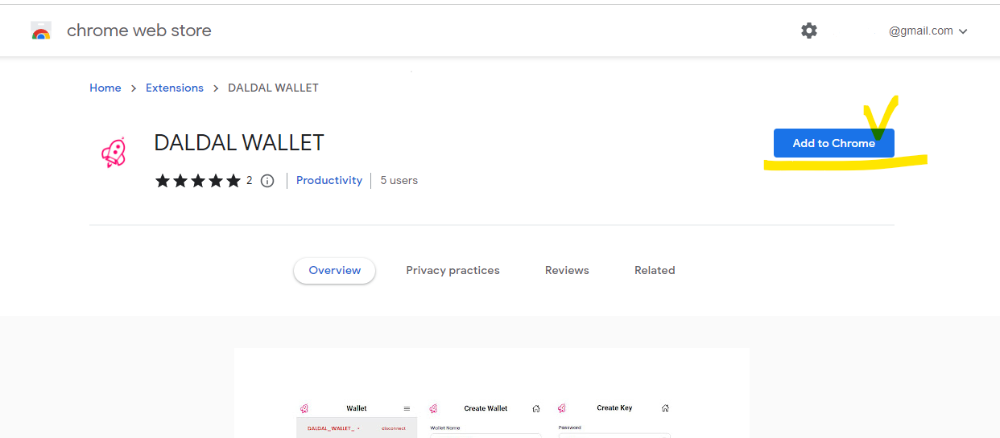
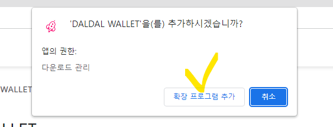
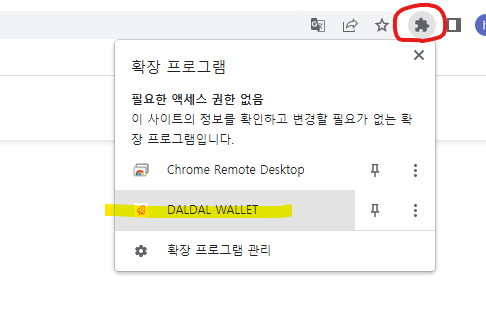
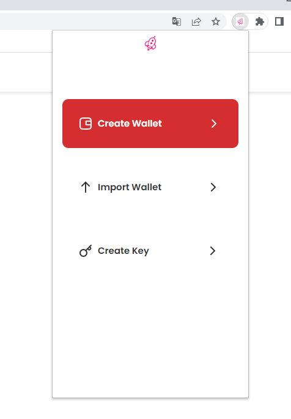

# DalDal Wallet Extension for CHROME

1. Connect here <a href="https://chrome.google.com/webstore/detail/daldal-wallet/chpijpegbmmcdkcednimifhdjbfghngm?hl=en">https://chrome.google.com/webstore/detail/daldal-wallet/chpijpegbmmcdkcednimifhdjbfghngm?hl=en</a>
<figure><figcaption></figcaption></figure>
<figure><figcaption></figcaption></figure>
2. Click the block shape on the top and press the DALDAL-WALLET to add it  
<figure><figcaption></figcaption></figure>
3. Screen that appears when the download is complete
<figure><figcaption></figcaption></figure>
