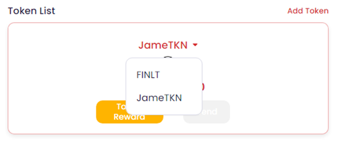

# Token List

## Add Token

You can **add/delete** Utility Tokens of FINL to/from your wallet.

Press the \[Add Token], then you can see the list of Utility Tokens.

<figure><figcaption></figcaption></figure>

Press the \[add] what you want to add to your wallet.

You can also \[delete] the Token from the wallet. Don't worry. Your balance of Token and the history of transactions are still remain within the FINL.

&#x20;You can change the Token by selecting the Token name from the list.

<figure><figcaption></figcaption></figure>

## Today Reward ( TestNet Only)

Only for Test, Press the \[Today Reward].

On the **Halla**(the **TestNet** of FINL), you can get the reward from some of Tokens for every 24 hours.

<figure><figcaption></figcaption></figure>

You **CANNOT** use these rewards for commercial use.

##

****

