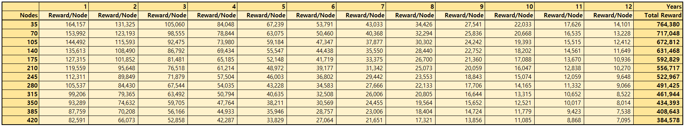

# Token List

## Add Token

You can **add/delete** Utility Tokens of FINL to/from your wallet.

Press the \[Add Token], then you can see the list of Utility Tokens.

<figure><figcaption></figcaption></figure>

Press the \[add] what you want to add to your wallet.

You can also \[delete] the Token from the wallet. Don't worry. Your balance of Token and the history of transactions are still remain within the FINL.

&#x20;You can change the Token by selecting the Token name from the list.

<figure><figcaption></figcaption></figure>

## Today Reward ( TestNet Only)

Only for Test, Press the \[Today Reward].

On the **Halla**(the **TestNet** of FINL), you can get the reward from some of Tokens for every 24 hours.

<figure><figcaption></figcaption></figure>

You **CANNOT** use these rewards for commercial use.

## Transactions

You can transmit tokens, if you have some amounts of tokens.

### Sequences of Transactions

#### Click the \[Send]&#x20;

<figure><figcaption></figcaption></figure>

#### Write down the \[Send to]

You have to write the wallet name that you want to send the Token. If you have already imported your another wallet, you can select it from the list. Or you can also enter the other user's wallet name that exists on the FINL.

<figure><figcaption></figcaption></figure>

#### Write down the \[Amount]

You have to decide how much you want to send.&#x20;

If you hope to send the whole of your balance, the it  is to be possible pressing \[Send all].

#### Upload KeyStore File

You have to upload the KeyStore File of the wallet to make a signature of smart contract.

#### Write down the \[password]

When the written password is proper, you can move on Next.

<figure><figcaption></figcaption></figure>

**NOTE :** Check your inputs before you make a transaction.

When you sure about your decision, press \[Send Now]. If you want to change something, you can press \[Back] to make it.

