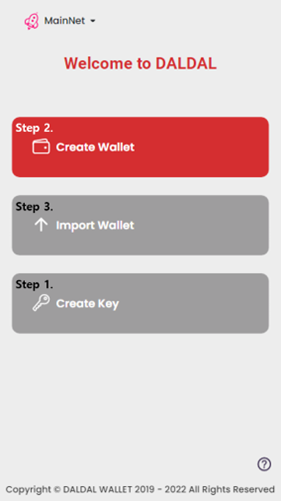

# Joining on DALDAL

## New Users

<figure><figcaption></figcaption></figure>

### Step 1. Create a Key

You need a KeyStore File to make and use a wallet, the account of the FINL. A KeyStore File is a json file that contains a pair of private key and public key.&#x20;

When you lost your KeyStore File, you can **RESTORE** KeyStore File by following steps below again with the same password and seed sentence.

#### Step 1-1. Click the \[Crate Key]

Click the \[Create Key] button to create your own key.

<figure><figcaption></figcaption></figure>

#### Step 1-2. Password

Insert your own **password**. Your password must fit to the format: 10 – 20 capital and small letters of English alphabets, numbers, and special symbols(!, @, $, ^, \~, \*, +, =, +, -). You have to combine the password by using at least one of those.

#### Step 1-3. Seed Sentence

Insert your own **a seed sentence**. You can write down your own seed sentence. You have to type 20 – 500 capital or small letters of English alphabets.

you might create a seed sentence with automatically generated mnemonic phrase(24 words) by pressing \[AUTO].

#### Step 1-4. Create key

The generated keyStore file should be downloaded by pressing \[Create Key] button.&#x20;

**Please safely keep your KeyStore File.** Also you **should REMEMBER** the password and sentence written down at previous steps. If you forgot the password and the seed sentence, you **CANNOT** **restore** the KeyStore File. It means that you **CANNOT** use your wallet.

### Step 2. Create a Wallet

You have to make a wallet to be a user of the FINL. You need a KeyStore File that you have created at the previous step.

You should be already on Create Wallet page by following previous step.

#### Step 2-1. Click the \[Create Wallet]

Click the \[Create Wallet] button to be a member of the FINL.

  

#### Step 2-2. Wallet Name

Enter a wallet name that you hope to use on FINL. Your wallet name should fit to the format: 4 – 20 capital letters of English alphabet, \_, numbers.

#### Step 2-3. Key

Upload the KeyStore file which is downloaded on Step 1.

#### Step 2-4. Input password

Enter the password that you entered on Step 1-2.

**NOTE** : If you forgot the password used on Step 1-2, you CANNOT use the KeyStore File.

#### Step 2-5. Terms of Service

You have to read and agree to Terms of Service to create wallet for FINL.&#x20;

Click the underlined text button \[Terms of Service] to check the contents of Terms of Service; And, check on the radio button.

#### Step 2-6. Create Wallet

If all of the criteria below are satisfied, then the \[Create Wallet] button should be enabled.

* The entered wallet name is available,&#x20;
* The entered password for the uploaded KeyStore File is correct,&#x20;
* and it had been checked to agree the Terms of Service.

Press the \[Create Wallet] button.

## Already Joined Users

### Step 3. Import a Wallet

If you already have the wallet of FINL, you can use it again with the below steps.

#### Step 3-1. Click the \[Import Wallet]

   

#### Step 3-2. Terms of Service

You have to read and agree to Terms of Service to create wallet for FINL.&#x20;

Click the underlined text button \[Terms of Service] to check the contents of Terms of Service; And, check on the radio button.

#### Step 3-3. Key

Upload the KeyStore previously used to make the wallet.

#### Step 3-4. Input password

Enter the password that you entered on Step 1-2.

**NOTE** : If you forgot the password used on Step 1-2, you CANNOT use the KeyStore File.

## Restoring a KeyStore file

Create Key section on step 1 should be used to restore lost KeyStore file.

* Write down the saved password used previously to make KeyStore file.
* Write down the saved seed sentence used previously to make KeyStore file.&#x20;

