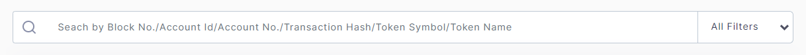
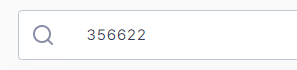
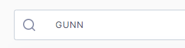
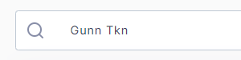
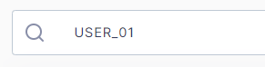
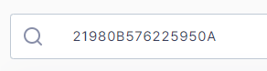
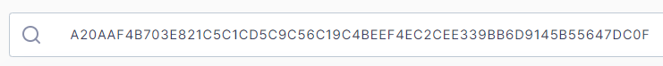

# 3. Features on BLOCK EXPLORER

* 3.1 Search
If user wants to see detail information, user can input search values on search bar. The website move to detail page of input value by typing 'Enter' key on search bar. The values that the user can input are as follows. 
<figure><figcaption></figcaption></figure>

<figure><figcaption></figcaption></figure>

<figure><figcaption></figcaption></figure>

<figure><figcaption></figcaption></figure>

<figure><figcaption></figcaption></figure>

<figure><figcaption></figcaption></figure>

<figure><figcaption></figcaption></figure>

## How to copy to clipboard
User can copy block no, transaction hash(ID), account ID, account No. token name, token symbol from the data tables on the each page.

<figure><figcaption></figcaption></figure>

Right click on the values(distinguished by ‘red’ font) in the data tables
  

<figure><figcaption></figcaption></figure>

Left click on the copy logos in the detail pages
  
