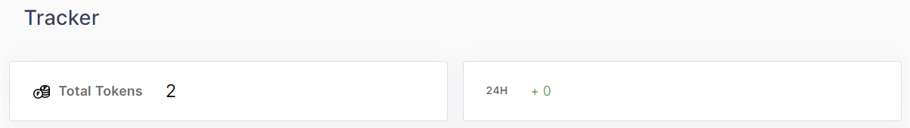

## 2.3 Tokens
### 2.3.1.	Tracker

> -	Total Tokens, 24H increase                                         

<figure><figcaption></figcaption></figure>

Each widget shows the number of values.

> - Table                                         

<figure><figcaption></figcaption></figure>
The table has Name, Symbol, Account No, Market Supply, Action, BPs columns.
User can see detail page of Token by clicking left-button on mouse.(name, symbol, action)
