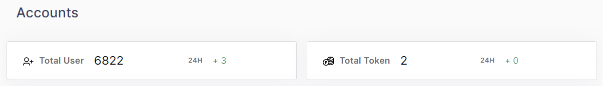
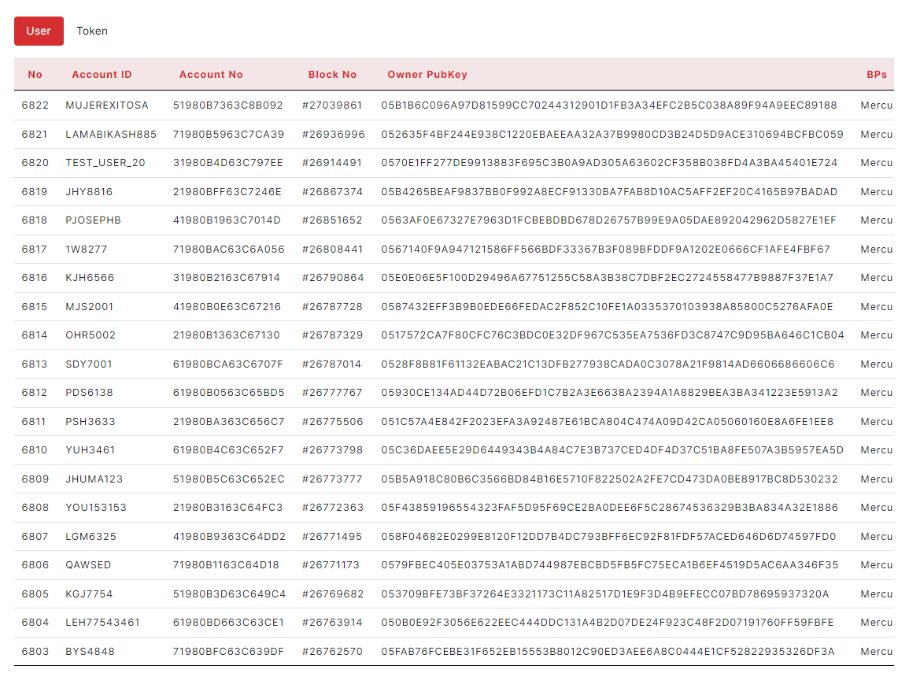
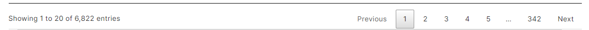

### 2.2.4 Accounts

> -	Total User, Total Token   

<figure><figcaption></figcaption></figure>

Each widget shows total number, 24h increase.
  

> -	Tables(User, Token)
<figure><figcaption></figcaption></figure>
        The table has No, Account ID, Account No., Block no, Owner Public Key, BPs columns. 	
	    User can copy account number, block number by clicking right-button on mouse. 
	    User can see detail page of Blocks by clicking left-button on mouse.(Block No) 
	    User can see detail page of Account by clicking left-button on mouse.(Account ID, Account No, Owner Public Key)

> -	Pagination
<figure><figcaption></figcaption></figure>

User can see the table of clicked number on pagination.
  
