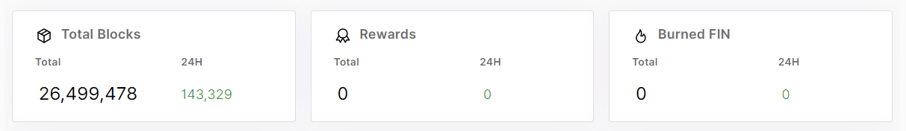
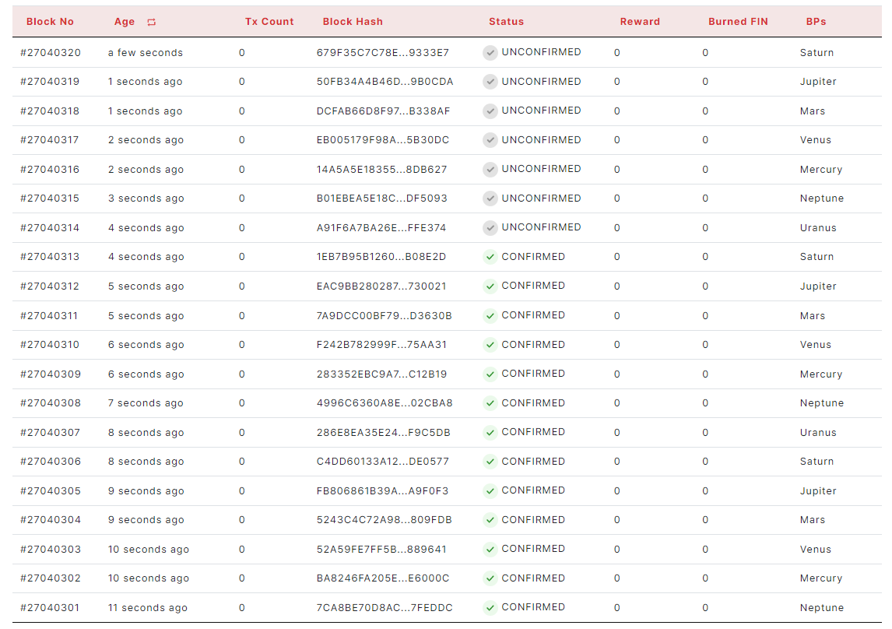
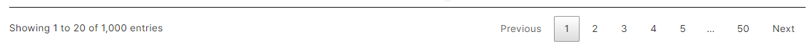

### 2.2.1.	Blocks

> - Total Blocks, Rewards, Burned FIN

<figure><figcaption></figcaption></figure>

Each widget shows total number, 24h increase

> - Table

<figure><figcaption></figcaption></figure>
The table has Block No, Age, Transaction count, Block hash, Status, Reward, Burned FIN, BPs columns. 
Age/Time can be converted each other by clicking on the header. 
User can copy block number by clicking right-button on mouse. 
User can see detail page of Blocks by clicking left-button on mouse.(Block No, Block Hash)

<figure><figcaption></figcaption></figure>
User can see the table of clicked number on pagination.
