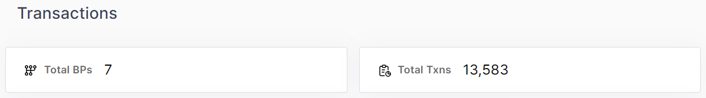
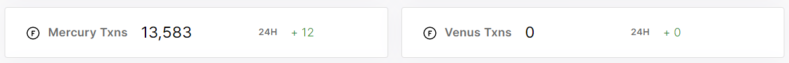
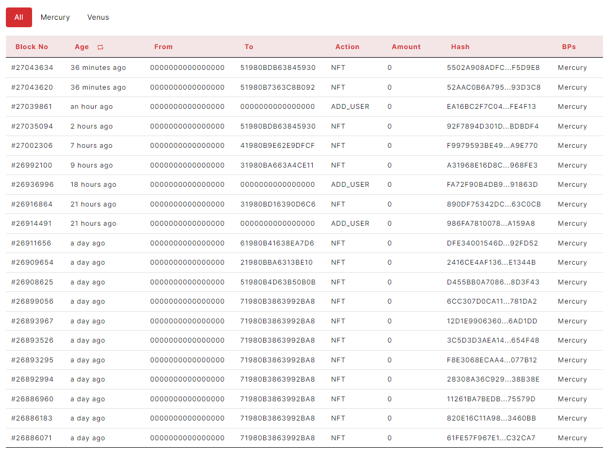
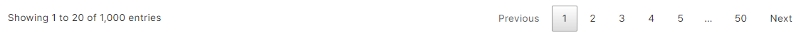

### 2.2.2.	Transactions

> -	Total BPs, Total Transactions

<figure><figcaption></figcaption></figure>

Each widget shows total number.

> -	BP1 Transactions, BP2 Transactions
<figure><figcaption></figcaption></figure>

Each widget shows total number, 24h increase.

> -	Tables(All, BP1, BP2)
<figure><figcaption></figcaption></figure>

The table has Block No, From, To, Action, Amount, Hash, BPs columns.

User can copy block number, from, to, hash by clicking right-button on mouse. 
User can see detail page of Blocks by clicking left-button on mouse.(Block No) 
User can see detail page of Account by clicking left-button on mouse.(From, To) 
User can see detail page of Transactions by clicking left-button on mouse.(Hash)

> -	Pagination
<figure><figcaption></figcaption></figure>

User can see the table of clicked number on pagination.
