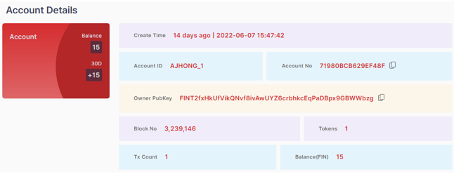
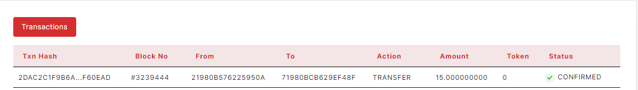

### 2.4.3. Account Details

> -	Create Time, Account ID, Account No, Owner Public Key, Block No, Tokens, Transaction Count, Balance(FIN)      

<figure><figcaption></figcaption></figure>

Each widget shows the number of values.

> -	Transactions Table
                                
<figure><figcaption></figcaption></figure>

The table has Transaction Hash, Block No, From, To, Action, Amount, Token, Status.
