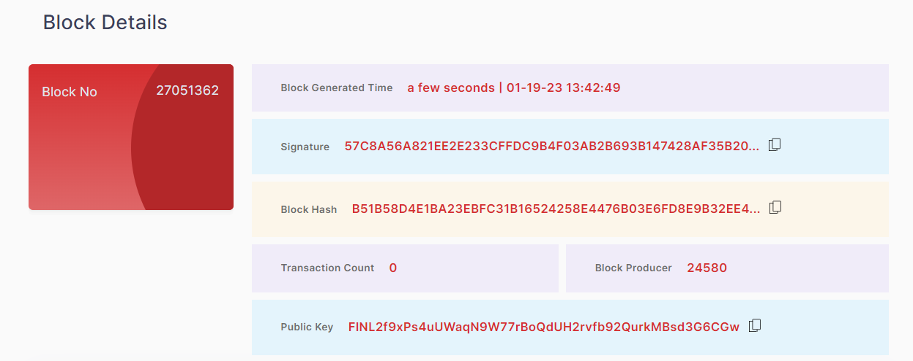
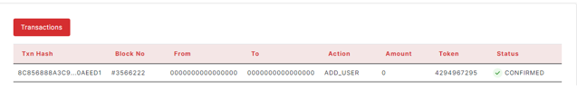

## 2.4.	Detail Pages
### 2.4.1. Block Details

> -	Block No., Block Generate Time, Signature, Block Hash, Transaction Count, Block Producer, Public Key                                      
<figure><figcaption></figcaption></figure>

Each widget shows the number of values.

> -	Transactions Table                                     
<figure><figcaption></figcaption></figure>

The table has Transaction Hash, Block No., From, To, Action, Amount, Token, Status columns.
