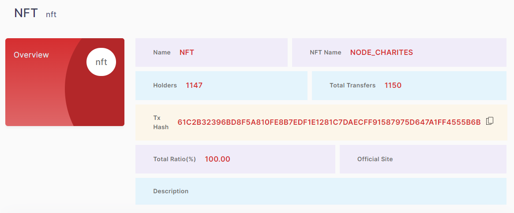
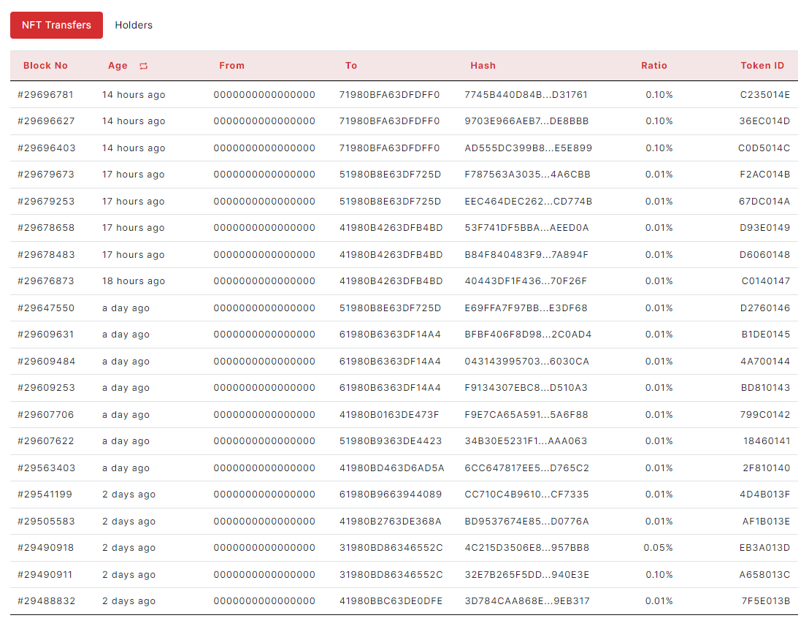

## 2.4. Detail Pages
### 2.4.5 NFT Details

> -	Name, NFT Name, Holders, Total Transfers, Tx Hash, Total Ratio, Official Site, Description
<figure><figcaption></figcaption></figure>

Each widget shows the number of values.

> -	Transactions Table                                     
<figure><figcaption></figcaption></figure>

The table has Block No, Age, From, To, Hash, Ratio, Token ID columns.
