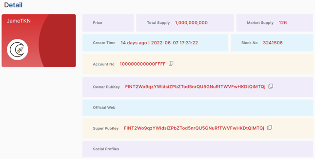
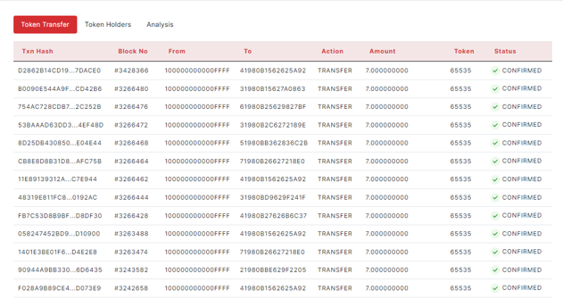
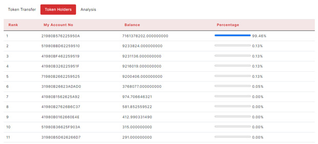

### 2.4.4. Token Details

> -	Price, Total Supply, Market Supply, Create Time, Block No, Account No, Owner Public Key, Official Web,  Super Public Key, Social Profiles                                        

<figure><figcaption></figcaption></figure>

Each widget shows the number of values.

> -	Transactions Table
                                
<figure><figcaption></figcaption></figure>

The token transfer table has Transactions Hash, Block No, From, To, Action, Amount, Token, Status.

<figure><figcaption></figcaption></figure>

The token holders table has Rank, My Account No, Balance, Percentage.
