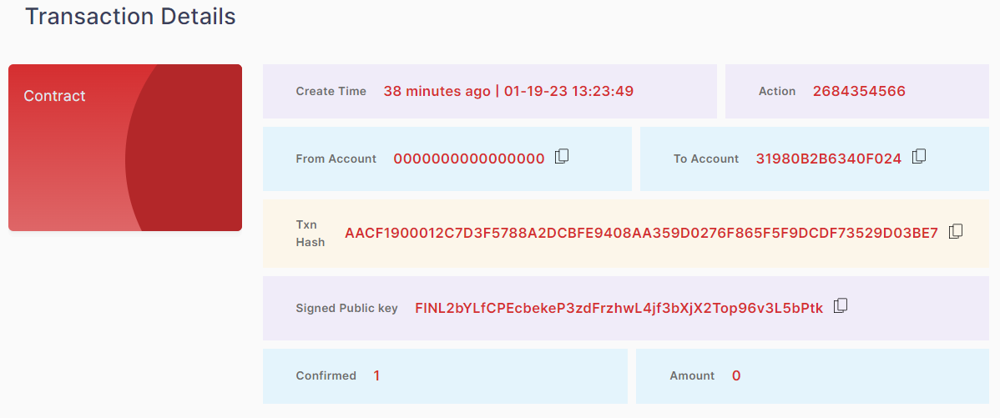
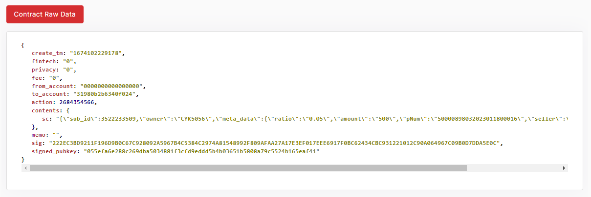

### 2.4.2. Transaction Details

> -	Create Time, Action, From Account, To Account, Transaction Hash, Signed Public Key, Confirmed, Amount

<figure><figcaption></figcaption></figure>

Each widget shows the number of values.

> -	Contract Raw Data                                 
<figure><figcaption></figcaption></figure>

It shows contract's JSON data.
