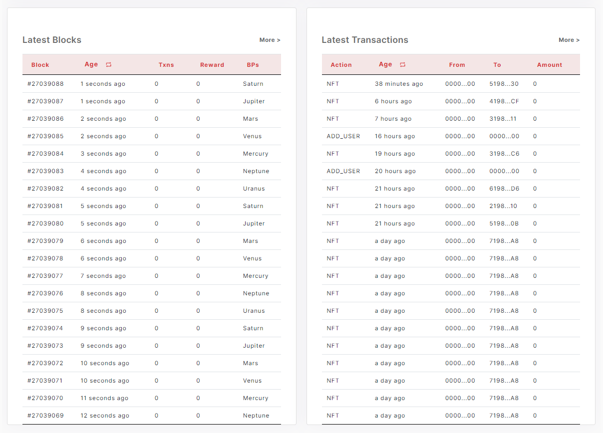

### 2.1.4.	Lower

> - Latest Blocks table
>>>	   It has block, age, transactions, reward, BPs columns.
>>>	   Age/Time can be converted each other by clicking on the header.
>>>	   User can copy block number by clicking right-button on mouse.
>>>	   User can see detail page of Blocks by clicking left-button on mouse.	 
>>>	   It refresh data every 4 seconds.

> - Latest Transactions table
>>>	   It has block, from, to, action, amount columns.
>>>	   User can copy block number, from account No. to account No by right-clicking.
>>>	   User can see detail page of blocks, account, transactions by clicking left button on mouse.	 
>>>	   It refresh data every 4 seconds.	

<figure><figcaption></figcaption></figure>