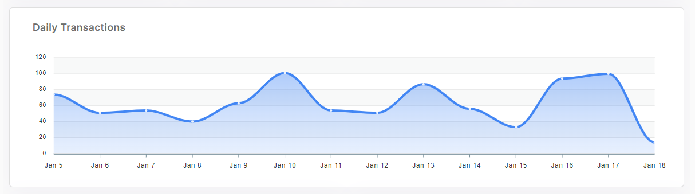

### 2.1.3.	Middle-lower

<figure><figcaption></figcaption></figure>
The chart shows 'Daily Transactions'. It's visualized graph from 'Total Transactions' data. User can see how the transactions number increased/decreased on the daily chart. Small popup appear when user hover the mouse on the chart. It shows exact transaction number on specific date.