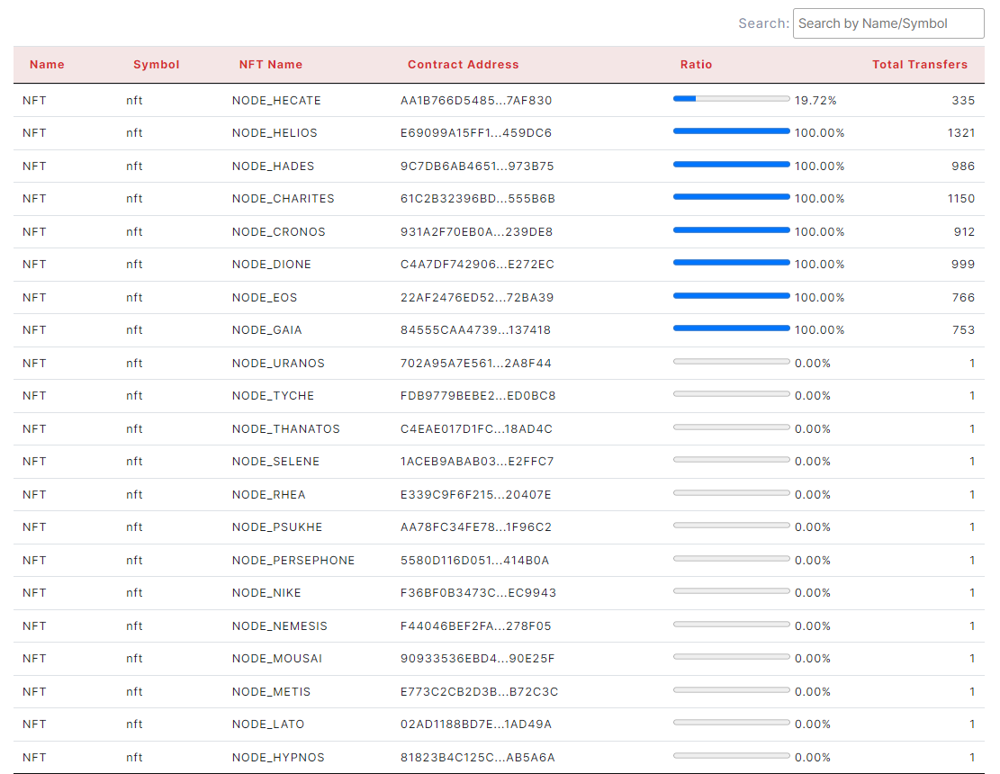

## 2.5 Node

> - Table                                         

<figure><figcaption></figcaption></figure>
The table has Name, Symbol, NFT Name, Contract Address, Ratio, Total Transfers columns.
User can see detail page of Token by clicking left-button on mouse.(name, symbol, NFT Name, Contract Address)
